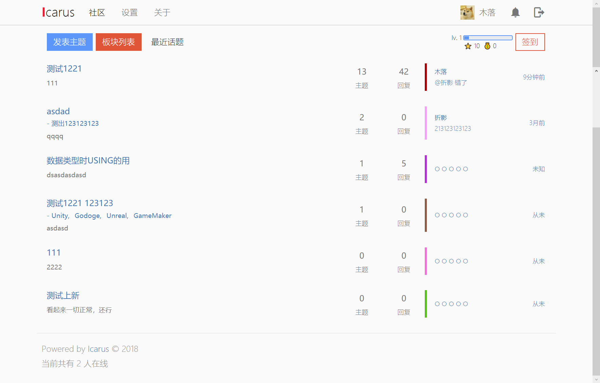

# Icarus

> A opensource forum project write with python3 and vue.js

[更多截图(旧版)](SCREENSHOT.md)

[2.0分支开发中，路线图见此](https://t.myrpg.cn/topic/2827)

### 注意

目前的master分支已经合并了2.0部分内容，实际上等价于1.3的SSR版本。

此分支将暂时不再添加新的功能，只做BUG维护。功能的开发将在2.0分支进行。

这个版本就不单独release了，如有bug请及时反馈，谢谢。

## 如何部署

内容较多，详见[部署文档](misc/how-to-deploy.md)

## 开源协议

[ZLIB](LICENSE)

免费且商业友好，这个协议基本上和MIT相同。

## 特性

* 全局

    * 文件上传(七牛云)

    * 超宽屏支持

    * 简易的移动端支持

    * 实时在线人数

    * Markdown发帖和评论

    * 包含主题、评论、百科内容的全文搜索(基于Elasticsearch)

* 用户系统

    * 注册、登录

    * 邮件激活

    * 邮箱找回密码

    * 修改个人信息

    * 上传头像（七牛云）

    * 每日签到

    * 个人提醒

* 论坛

    * 扁平化的内容展示

    * 创建和管理板块

    * 板块主题颜色

    * 发表和编辑主题

    * 文章页自动生成快捷导航

    * @功能

* 百科

    * 自定义侧边栏和主页

    * 文章的创建和编辑

    * 全部文章列表

    * 文章历史

    * 随机页面

* 管理后台

    * 提供对板块、主题、用户、评论的管理

    * 管理日志

* 安全机制

    * 前端密码加密，后端不取得用户的初始密码，最大限度降低了中间人攻击和数据库泄露的危害

    * 后端二次加密，sha512加盐迭代十万次后储存用户密码

    * 密码相关API均有防爆破，可设置IP请求间隔和账号请求间隔，分别提升批量撞库和单点爆破的难度

    * 隐私数据，例如IP地址脱敏后才可存入数据库

## 升级指南

首先停止服务并更新源码。

然后请寻找 `backend/misc/upgrade` 目录下对应的升级文件，例如1.2升级1.3使用`u12-u13.py`。

在 `backend` 目录下执行后删除即可。

注意如果使用了 pipenv 或其他虚拟环境，要在项目对应环境中完成这个操作。

然后分别升级前端项目(根目录)和后端项目(backend目录)的项目依赖。

如该版本无特别的升级说明，此时直接重新开启服务即可。

## 规划

由于空闲时间有限，而且是单枪匹马做整个项目的开发。

目前的版本还有一些不完善的地方以及缺少的功能来不及完成，姑且规划如下：

近期：

* 收藏、感谢、点赞

* 个人中心

* 强化移动端体验

* 支持用户对评论进行自删和编辑等操作

后续：

* 多终端同时登录的支持

* 支持第三方登录

* 搭建独立的项目站点

* RSS支持

* 完善tests

## 捐赠

在开发这个项目的过程中，我付出了大量的时间和精力。希望这个项目能对大家所有帮助，或者你们能够喜欢这个项目。

这对我来说已经是很好的肯定，请务必点个star让我知道。

也欢迎以捐助的形式来支持我的开发：

微信
